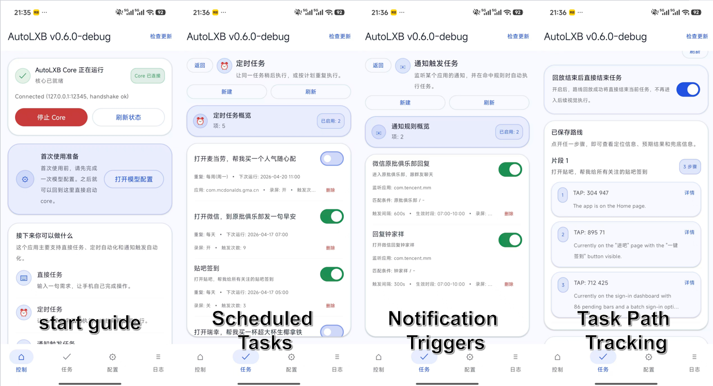
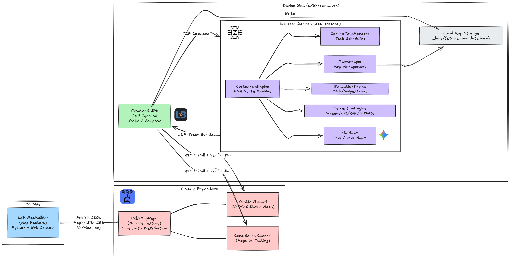
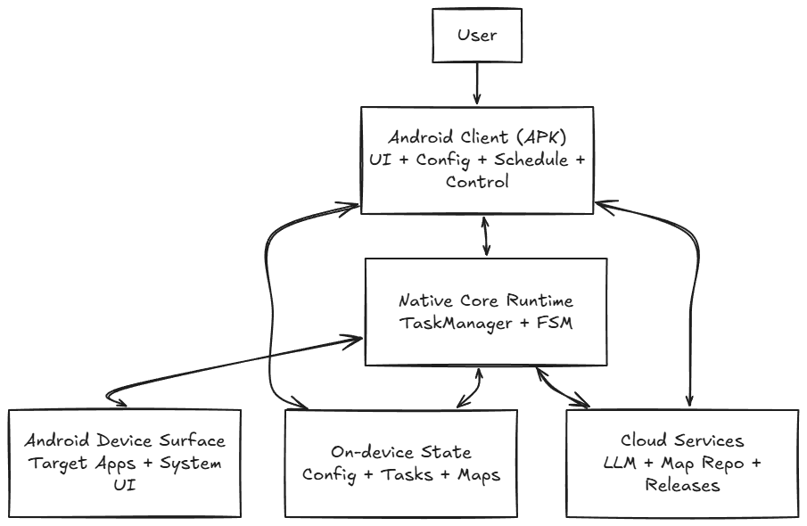

<div align="center">


# LXB-Framework

**Experimental Android automation framework for repetitive, linear daily tasks**

[](LICENSE)
[]()
[](https://github.com/wuwei-crg/LXB-Framework/releases)

**English** | [中文](README.md)

</div>

LXB-Framework does not let the model freely roam across the whole phone UI. It uses a **Route-Then-Act** pipeline: prebuilt navigation maps handle deterministic page routing, and the vision model only steps in when real on-screen interaction is needed.

---

## Software Preview & Feature Overview



Current core capabilities:

- **Chat tasks**: submit one natural-language task and run it immediately
- **Scheduled tasks**: one-shot / daily / weekly execution, with list-level enable/disable toggles
- **Notification-triggered tasks**: trigger tasks from notification dump matching with package, title, body, and optional LLM filtering
- **Playbook fallback**: add step-by-step instructions for apps that do not have a navigation map yet
- **Dual startup paths**: `Wireless ADB` for non-root devices, `Root startup` for rooted devices
- **Trace page**: structured core trace cards, detail viewer, and local export

## How It Works

The Route-Then-Act pipeline is supported by several cooperating pieces:

- **Pipeline split**: tasks are divided into a routing phase and an action phase. Routing is handled as deterministically as possible with maps, then the VLM handles dynamic UI work.
- **FSM orchestration**: a full FSM keeps INIT, TASK_DECOMPOSE, APP_RESOLVE, ROUTE_PLAN, ROUTING, VISION_ACT, and FINISH/FAIL traceable and debuggable.
- **`app_process` daemon**: `lxb-core` runs as a shell-level process outside the normal Android app lifecycle, which makes it suitable for background execution, scheduled tasks, and notification triggers.
- **Device-side split**: `LXB-Ignition` handles startup, configuration, task management, and logs; `lxb-core` handles local automation execution.





## Current Product Shape

The current app is organized into four main areas:

- **Home**: choose startup method (`Wireless ADB` / `Root`), check runtime state, submit chat tasks
- **Tasks**: manage schedules, notification-triggered rules, and recent runs
- **Config**: control mode, device-side LLM, unlock policy, map sync, language
- **Logs**: trace cards, trace details, and trace export

Important UX points in the current design:

- schedules and notification rules can both be **enabled/disabled directly from the list page**
- input can prefer **ADB Keyboard** and fall back automatically when unavailable
- touch injection supports both **Shell** and **UIAutomator** strategies
- UI language follows the system by default: Chinese phones default to Chinese, everything else defaults to English; once the user switches manually, the manual choice wins

## Requirements

Before starting, make sure:

- you are using a real Android device on **Android 11 (API 30)** or above
- for **Wireless ADB startup**: Developer Options, USB debugging, and Wireless debugging are enabled
- for **Root startup**: the device is rooted and can grant `su`
- an **OpenAI Chat Completions-compatible** LLM / VLM endpoint is configured
  - the app now auto-completes `/chat/completions`
  - you can enter a higher-level base URL such as `https://xxx/v1`, and the app shows the resolved final request URL in real time

## Quick Start

### Option 1: Non-root device (`Wireless ADB startup`)

1. Install the latest APK from [Releases](https://github.com/wuwei-crg/LXB-Framework/releases)
2. Enable the required developer settings on the phone:
   - `USB debugging`
   - `Wireless debugging`
   - **USB debugging must stay enabled, otherwise process keepalive may fail**
3. Some ROMs need extra adjustments:

   | ROM | Action |
   |-----|--------|
   | MIUI / HyperOS (Xiaomi, POCO) | enable `USB debugging (Security settings)` |
   | ColorOS (OPPO / OnePlus) | disable `Permission monitoring` |
   | Flyme (Meizu) | disable `Flyme payment protection` |

4. Open `LXB-Ignition` and enter `Wireless ADB startup`
5. Follow the in-app guide once:
   - open Developer Options
   - enable Wireless debugging
   - open `Pair device with pairing code`
   - enter the 6-digit pairing code in the app notification
6. After pairing, start core from the home page. Later launches usually do not need re-pairing as long as Wireless debugging is enabled.

### Option 2: Rooted device (`Root startup`)

1. Install the APK
2. Open `Root startup` from the home page
3. Confirm root permission is available
4. Start core directly through `su`

## First Configuration Pass

After core is up, check these pages in `Config` first.

### 1. Control Mode Config

This page decides how taps, swipes, and text input are executed:

- **Touch input mode**: `Shell` / `UIAutomator`
- **ADB Keyboard detection**: recommended for more stable Chinese input
- **Task-time Do Not Disturb**: keep current state, set OFF, or set NONE

### 2. Device-side LLM Config

Fill in:

- `API Base URL`
- `API Key`
- `Model`

Current extras:

- **resolved final request URL preview**
- **multiple saved local LLM profiles**
- **masked API key display**

### 3. Unlock & Lock Policy

- auto unlock before routing
- auto lock after task
- lock PIN / password, only used when swipe alone is not enough

### 4. Map Sync & Source

- set MapRepo URL
- choose runtime map source (`stable` / `candidate` / `burn`)
- sync maps by package or identifier

## Task Types

### Chat Tasks

Submit one natural-language request from the home page, for example:

```text
Open WeChat and send "hello" to File Transfer
Open Bilibili and post a new status with title test and content test
```

### Scheduled Tasks

Create them in `Tasks -> Schedules`:

- one-shot / daily / weekly
- optional target package
- optional Playbook
- optional screen recording
- **can be enabled/disabled directly from the list page**

### Notification-Triggered Tasks

Create them in `Tasks -> Notification Triggers`:

- required package match
- optional title / body match
- optional LLM condition
- optional active time window
- optional task recording
- **can be enabled/disabled directly from the list page**

Current notification-trigger pipeline:

1. dump notifications
2. detect new notifications
3. evaluate rules in order
4. build the final task when matched
5. push that task into the core queue

## Trace & Debugging

The logs page is now a trace viewer instead of a plain text log panel:

- each trace entry is rendered as an individual card
- tapping a card opens structured details
- latest traces load first
- older traces load on upward scrolling
- cached traces can be exported to local storage

This is the most useful page for debugging FSM flow, notification triggers, and execution failures.

## Usage Notes

- set `LXB-Ignition` battery policy to **Unrestricted**
- without ADB Keyboard, Chinese input falls back to clipboard / shell-based paths and compatibility may vary by app
- for apps without maps, write short and explicit Playbooks
- some ROMs behave better with `Shell`, others with `UIAutomator`, so test both control paths

## Developer Debug Workflow

After code changes, install a debug build to your phone:

1. connect the device and confirm `adb devices` can see it
2. go to `android/LXB-Ignition`
3. run:

```bash
./gradlew :app:installDebug
```

Then open the debug build of `LXB-Ignition` on the phone.

## Related Repositories

| Repository | Description |
|------------|-------------|
| [LXB-MapBuilder](https://github.com/wuwei-crg/LXB-MapBuilder) | map building and publishing tool |
| [LXB-MapRepo](https://github.com/wuwei-crg/LXB-MapRepo) | stable / candidate map repository |

## Acknowledgements

The `app_process` daemon design is inspired by [Shizuku](https://github.com/RikkaApps/Shizuku).

LXB-Framework implements its own Wireless ADB pairing, connection, and startup flow and does not depend on Shizuku at runtime. The project is also actively shared in the [LINUX DO community](https://linux.do/).

Third-party notices: [THIRD_PARTY_NOTICES.md](THIRD_PARTY_NOTICES.md)

## License

MIT. See [LICENSE](LICENSE).

## Star Trend

[](https://star-history.com/#wuwei-crg/LXB-Framework&Date)
