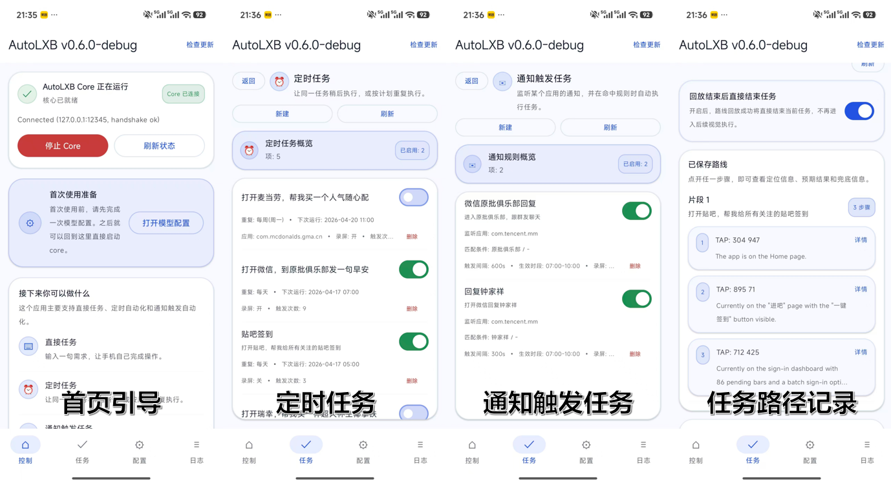

<div align="center">


# LXB-Framework

**实验性安卓端自动化框架，专注于高频、线性的日常任务自动执行**

[](LICENSE)
[]()
[](https://github.com/wuwei-crg/LXB-Framework/releases)

[English](README.en.md) | **中文**

</div>

LXB-Framework 不让模型自由探索整个手机界面，而是采用 **Route-Then-Act** 流水线：预构建导航地图负责确定性的页面跳转，视觉模型只在真正需要“动手”的阶段介入。

---

## 软件展示与功能概览



当前版本的核心能力：

- **对话任务**：输入自然语言需求，立即执行一次任务
- **定时任务**：支持单次 / 每天 / 每周执行，并可在列表中直接启用或停用
- **通知触发任务**：监听通知栏 dump，按包名、标题、正文和可选 LLM 条件触发任务
- **Playbook 兜底**：为暂无导航地图的 App 编写操作说明，帮助 Vision 阶段稳定落地
- **Root / Wireless ADB 双启动方式**：未 Root 设备走无线调试引导，Root 设备可直接启动 core
- **Trace 日志页**：按条展示 core trace，支持详情查看、结构化字段解析与本地导出

## 工作原理

Route-Then-Act 流水线由以下几部分协同支撑：

- **流水线拆分**：任务被拆成路由阶段和动作阶段。路由阶段尽量走地图和确定性页面跳转，动作阶段再交给 VLM 处理动态 UI。
- **FSM 状态机编排**：完整状态机负责把 INIT、TASK_DECOMPOSE、APP_RESOLVE、ROUTE_PLAN、ROUTING、VISION_ACT、FINISH/FAIL 串起来，便于调试与追踪。
- **`app_process` 守护进程**：core 以 shell 级进程运行，脱离 Android App 的普通生命周期，适合后台常驻、定时任务和通知触发。
- **设备端前后端分离**：`LXB-Ignition` 负责启动、配置、任务管理与日志查看，`lxb-core` 负责本机自动化执行。


## 现在的产品形态

当前 App 主要分为四个区域：

- **首页**：选择启动方式（Wireless ADB / Root）、查看运行状态、提交对话任务
- **任务页**：管理定时任务、通知触发任务、最近执行记录
- **配置页**：控制方式配置、设备端 LLM 配置、解锁策略、地图同步、语言设置
- **日志页**：查看 trace 卡片、展开详情、导出缓存 trace

其中比较关键的设计点：

- 定时任务和通知触发任务都支持在**列表页直接开关**，不必进入编辑页
- 输入策略支持优先使用 **ADB Keyboard**，未安装时自动回退
- 控制方式支持 **Shell / UIAutomator** 两种触摸注入路径
- 应用语言默认跟随手机系统：中文默认中文，其他语言默认英文；手动切换后优先使用用户选择

## 环境要求

开始前请确认：

- Android **11（API 30）** 及以上真机
- 使用 **Wireless ADB** 启动时：已打开开发者选项、USB 调试、无线调试
- 使用 **Root** 启动时：设备已 Root，且能授予 `su` 权限
- 已配置兼容 **OpenAI Chat Completions** 风格的 LLM / VLM 接口
  - 现在会自动补齐 `/chat/completions`
  - 也就是说你可以填写 `https://xxx/v1` 或更上层的基础 URL，App 会显示最终真实请求地址

## 快速开始

### 方式一：未 Root 设备（Wireless ADB）

1. 安装最新版 APK：从 [Releases](https://github.com/wuwei-crg/LXB-Framework/releases) 下载 `lxb-ignition-vX.Y.Z.apk`
2. 打开手机开发者选项，确保以下开关已打开：
   - `USB 调试`
   - `无线调试`
   - **必须开启 USB 调试，否则进程可能无法保活**
3. 某些 ROM 还需要额外设置：

   | ROM | 操作 |
   |-----|------|
   | MIUI / HyperOS（小米、POCO） | 开启“USB 调试（安全设置）” |
   | ColorOS（OPPO / OnePlus） | 关闭“权限监控” |
   | Flyme（魅族） | 关闭“Flyme 支付保护” |

4. 打开 `LXB-Ignition` 首页，进入 `Wireless ADB startup`
5. 按引导完成一次配对：
   - 打开开发者选项
   - 打开无线调试
   - 点击“使用配对码配对设备”
   - 在 App 通知栏输入 6 位配对码
6. 配对后可直接从首页启动 core；后续再次启动时，只要无线调试已打开，一般无需重新配对

### 方式二：已 Root 设备（Root startup）

1. 安装 APK
2. 在首页进入 `Root startup`
3. 确认已授予 Root 权限
4. 点击启动，App 会直接通过 `su` 拉起 `lxb-core`

## 首次配置建议

完成启动后，建议先在 `Config` 中检查以下配置：

### 1. 操控方式配置

这里决定设备如何执行点击、滑动、输入等操作：

- **触摸注入模式**：`Shell` / `UIAutomator`
- **ADB Keyboard 检测**：推荐安装，用于提升中文输入稳定性
- **任务期间免打扰**：支持保持当前状态、设为 OFF、设为 NONE

### 2. 设备端 LLM 配置

需要填写：

- `API Base URL`
- `API Key`
- `Model`

当前还支持：

- **实时显示真实请求 URL**
- **保存多份本地 LLM 配置并切换**
- **API Key 密码样式显示**

### 3. 解锁与锁屏策略

- 是否在路由前自动解锁
- 是否在任务结束后自动锁屏
- 锁屏密码 / PIN（仅在单纯上滑不足以解锁时使用）

### 4. 地图同步与来源

- 设置 MapRepo 地址
- 选择运行时 map source（stable / candidate / burn）
- 按包名或标识同步地图

## 任务能力

### 对话任务

在首页输入一句自然语言需求即可提交一次任务，例如：

```text
打开微信，给文件传输助手发送一条消息：hello
打开 Bilibili，发布一条动态，内容是 test，标题是 test
```

### 定时任务

在 `Tasks -> Schedules` 中创建任务：

- 支持 **单次 / 每天 / 每周**
- 支持指定目标包名
- 支持附加 Playbook
- 支持任务录屏
- 支持在**列表页直接启用 / 停用**

### 通知触发任务

在 `Tasks -> Notification Triggers` 中创建规则：

- 包名匹配（必填）
- 标题匹配 / 正文匹配（可选）
- LLM 条件判断（可选）
- 触发时段（可选）
- 任务录屏（可选）
- 支持在**列表页直接启用 / 停用**

当前通知触发链路是：

1. dump 通知栏
2. 找到新通知
3. 按规则顺序匹配
4. 命中后生成最终任务
5. 推送到 core 任务队列执行

## Trace 与调试

日志页已不是简单的文本面板，而是 core trace 视图：

- 每条 trace 单独显示为卡片
- 点击可查看结构化字段详情
- 默认优先加载最新 trace
- 上滑时再按需加载更早记录
- 支持导出缓存 trace 到手机本地

如果你在调试任务链路、通知触发或 FSM 状态切换，这一页会比旧日志视图更有用。

## 使用建议

- 将 `LXB-Ignition` 的电池策略设为 **无限制**
- 未安装 ADB Keyboard 时，中文输入会回退到剪贴板 / shell 输入路径，兼容性可能因 App 而异
- 对于没有地图的 App，尽量编写简短明确的 Playbook
- 某些 ROM 下触摸注入更适合 `Shell`，某些更适合 `UIAutomator`，可在配置页切换测试

## 开发者调试（本地联调）

改完代码后，可直接安装 Debug 版到手机：

1. 连接设备，确认 `adb devices` 能看到设备
2. 进入 `android/LXB-Ignition`
3. 执行：

```bash
./gradlew :app:installDebug
```

安装完成后，直接在手机上打开 Debug 版 `LXB-Ignition` 进行调试。

## 相关仓库

| 仓库 | 说明 |
|------|------|
| [LXB-MapBuilder](https://github.com/wuwei-crg/LXB-MapBuilder) | 建图与地图发布工具 |
| [LXB-MapRepo](https://github.com/wuwei-crg/LXB-MapRepo) | stable / candidate 地图仓库 |

## 致谢

`app_process` 守护进程的设计思路参考了 [Shizuku](https://github.com/RikkaApps/Shizuku)。

LXB-Framework 自行实现了 Wireless ADB 配对、连接与启动流程，运行时不依赖 Shizuku。本项目也在 [LINUX DO 社区](https://linux.do/) 持续分享与交流。

第三方声明见：[THIRD_PARTY_NOTICES.zh.md](THIRD_PARTY_NOTICES.zh.md)

## 许可证

MIT，见 [LICENSE](LICENSE)。

## Star 趋势

[](https://star-history.com/#wuwei-crg/LXB-Framework&Date)
